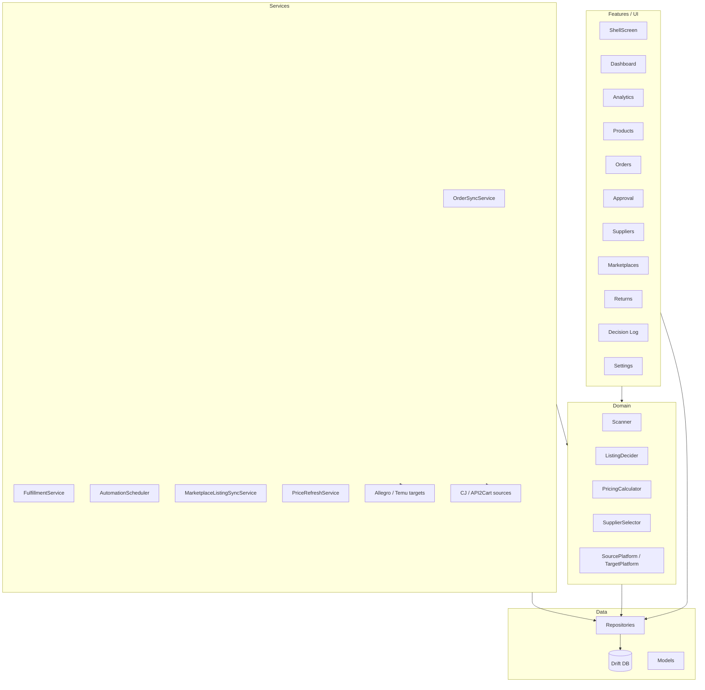

# Jurassic Dropshipping – Modules, Features, and Architecture

## 1. High-level architecture

- **Entry:** `lib/main.dart` → `ProviderScope` → `JurassicDropshippingApp` → `MaterialApp.router` + **AuthGate** → `lib/app_router.dart` (GoRouter) → **ShellRoute** → `lib/features/shell/shell_screen.dart` + per-route screens.
- **DI:** `lib/app_providers.dart` – Riverpod providers for DB, all repositories, auth, secure storage, OAuth, sync/fulfillment/automation, sources, and targets.

---

## 2. Modules and features by layer

### 2.1 Core (`lib/core/`)

| File | Purpose |
|------|---------|
| `lib/core/app_error.dart` | `ApiError` and app error handling. |
| `lib/core/logger.dart` | Central logging. |
| `lib/core/result.dart` | Result type for success/failure. |

---

### 2.2 Data layer (`lib/data/`)

**Database (`lib/data/database/app_database.dart`)**

- **Tables:** Products, Listings, Orders, DecisionLogs, UserRulesTable, Suppliers, SupplierOffers, Returns, MarketplaceAccounts, MessageThreads, Messages.
- **Storage:** Drift + conditional impl (IO vs Web) in `app_database_storage_io.dart` / `app_database_storage_web.dart`.
- **Migrations:** Schema versions with step migrations (e.g. v10 for payment fees, pricing strategy, category margins, KPI toggle).

**Models (`lib/data/models/`)**

- **Product** – source id, platform, title, basePrice, shippingCost, variants, supplierId, estimatedDays.
- **Listing** – productId, targetPlatformId, targetListingId, status (draft / pendingApproval / active / soldOut), sellingPrice, sourceCost, decisionLogId, promisedMin/MaxDays.
- **Order** – listingId, targetOrderId, targetPlatformId, status, sourceCost, sellingPrice, quantity, trackingNumber, decisionLogId, customerAddress, approvedAt, createdAt.
- **DecisionLog** – type (listing / order), entityId, reason, criteriaSnapshot (e.g. margin, strategy).
- **UserRules** – minProfitPercent, defaultMarkupPercent, marketplaceFees, paymentFees, pricingStrategy, categoryMinProfitPercent, premiumWhenBetterReviewsPercent, minSalesCountForPremium, kpiDrivenStrategyEnabled, targetsReadOnly, manualApprovalListings/Orders, seller return, return policy.
- **Supplier** – id, name, platformType, countryCode, rating, return window/cost, warehouse address.
- **SupplierOffer** – productId, supplierId, cost, shippingCost, min/max days, carrier.
- **ReturnRequest** – orderId, reason, status, refundAmount, returnShippingCost, returnToAddress, tracking, supplierId, productId.
- **MarketplaceAccount** – accountId, platformId, displayName, isActive (multi-account schema; not yet used for routing).
- **MessageThread / Message** – scaffolding only; `kEnableMessages = false`, no UI.

**Repositories (`lib/data/repositories/`)**

- **ProductRepository** – upsert by id, get, list.
- **ListingRepository** – insert, update, getByStatus, getByLocalId, getByProductId.
- **OrderRepository** – insert, update, getByLocalId, list, attachDecisionLog.
- **DecisionLogRepository** – insert, list by type.
- **RulesRepository** – get (or create default), save; maps all UserRules fields including paymentFees, pricingStrategy, category margins, KPI toggle.
- **SupplierRepository** – upsert, get, list.
- **SupplierOfferRepository** – upsert, get by product.
- **ReturnRepository** – insert, update, list by order.
- **MarketplaceAccountRepository** – CRUD for accounts (schema ready; app still uses one-account-per-platform).

**Seed**

- `lib/data/seed/database_seeder.dart` / `lib/data/seed/seed_data.dart` – minimal schema/seed.
- **SeedService** (`lib/services/seed_service.dart`) – `seedAll()` (small demo), `seedHeavy()` (~200 products, ~20k orders) for KPI testing.

---

### 2.3 Domain layer (`lib/domain/`)

**Decision engine (`lib/domain/decision_engine/`)**

| Component | Functionality |
|-----------|---------------|
| **PricingCalculator** | P_min (cost + category margin + total fee); total fee = marketplace + payment; strategies: always_below_lowest, premium_when_better_reviews, match_lowest, fixed_markup, list_at_min_even_if_above_lowest; KpiStrategySnapshot + effectivePricingStrategy; decideCompetitivePrice → PricingDecision (createAtPrice or rejectReason). |
| **ListingDecider** | decide(product, rules, targetPlatformId?, categoryId?, competitorInput?) – blacklist/maxPrice checks; uses PricingCalculator for competitive or fixed-markup path; enforces 5 PLN min profit, 10x cap; creates Listing (draft/pendingApproval) and reason/criteriaSnapshot. |
| **Scanner** | run() – loads rules, searches each source by keywords, supplierSelector picks product, **per-target** listingDecider.decide(..., targetPlatformId); inserts DecisionLog and listings per target. |
| **SupplierSelector** | select(products, rules) – chooses one product (e.g. preferred country, price). |

**Platforms (`lib/domain/platforms.dart`)**

- **SourcePlatform** – searchProducts, getProduct, getBestOffer, placeOrder, getOrderStatus, cancelOrder.
- **TargetPlatform** – createListing, updateListing, getOrders, updateTracking, getListingDetails, cancelOrder, getOrderStatus.
- **ListingDraft, PlaceOrderRequest, SourceOrderResult, SourceSearchFilters** – DTOs.

**Shipping**

- `lib/domain/shipping_estimator.dart` – shipping time estimation helpers.

---

### 2.4 Features / UI (`lib/features/`)

| Screen / Area | Route | Functionality |
|---------------|-------|---------------|
| **Shell** | (layout) | Sidebar nav, app bar, read-only vs live pill (from rules.targetsReadOnly). |
| **Dashboard** | `/dashboard` | KPI cards (listings, orders, returns), profit chart, automation card (scan/sync/price/marketplace sync toggles + last run times). |
| **Analytics** | `/analytics` | AnalyticsEngine: totalRevenue/Cost/Profit, profitMargin%, returnRate%; profitByPlatform; profitByProduct (top 10); issues (e.g. negative profit). |
| **Products** | `/products` | List products, search/filter. |
| **Orders** | `/orders` | List orders, status, "View failure reason" (decisionLogId), "Create return / complaint". |
| **Approval** | `/approval` | Pending listings (approve → create on target or reject) and pending orders (approve → allow fulfillment). |
| **Suppliers** | `/suppliers` | List suppliers. |
| **Marketplaces** | `/marketplaces` | List target platforms, connection status (e.g. Allegro connected). |
| **Returns** | `/returns` | List return requests, tap to edit (status, refund, shipping, restocking, notes). |
| **Decision log** | `/decision-log` | List decision logs (listing/order), filter by type, show reason and criteriaSnapshot. |
| **Settings** | `/settings` | Rules (keywords, min profit %, markup %, pricing strategy, Allegro/Temu fee %, payment fee %, per-category min profit %, premium % and min sales, KPI-driven strategy toggle), seller return address; integrations (CJ, Allegro OAuth, API2Cart); API features checklist; Load demo data / Load heavy demo (~20k orders); appearance; developer tools. |
| **Auth** | (gate) | AuthGate wraps router; LoginScreen for password / first-time. |
| **Shared** | – | EmptyState, ErrorCard, LoadingSkeleton, SearchFilterBar. |

---

### 2.5 Services (`lib/services/`)

| Service | Functionality |
|---------|---------------|
| **AuthService** | Password / lock state (e.g. Hive). |
| **SecureStorageService** | Tokens and secrets (CJ, Allegro, API2Cart, Temu). |
| **AllegroOAuthService** | OAuth2 code flow, token exchange, store in secure storage. |
| **OrderSyncService** | Poll targets for orders since T, insert new (pendingApproval if rules.manualApprovalOrders), sync status for existing. |
| **FulfillmentService** | For approved orders: resolve listing → product → source; place source order; update target tracking; on failure attach DecisionLog (listing/product/source/target missing, OOS, placeOrder error); set failed/failedOutOfStock; optional cancel on target. |
| **OrderCancellationService** | Cancel order on target (e.g. Allegro). |
| **MarketplaceListingSyncService** | Refresh product stock from sources, push stock/price to target listings; reappeared-product tracking. |
| **PriceRefreshService** | Refresh supplier offer prices. |
| **AutomationScheduler** | Timers for scan, order sync, price refresh, marketplace sync (intervals from rules); start/stop; persist last run times (Hive). |
| **ReturnPolicyService** | Map rules to marketplace return policy. |
| **SeedService** | seedAll(), seedHeavy() – products, listings, orders, returns, decision logs, rules. |

**Source platforms**

- **CjSourcePlatform** – CJ API client (search, product, place order, etc.).
- **Api2CartSourcePlatform** – API2Cart client for shop platforms.
- **TemuStubSource** – stub (if used).

**Target platforms**

- **AllegroTargetPlatform** – create listing, update listing, get orders (multi-line → one local Order per line), update tracking, cancel order.
- **TemuTargetPlatform** – gated by `kEnableTemuTarget`; stub/placeholder.
- **AmazonStubTarget** – throws UnsupportedError.

---

## 3. Data flow (summary)

- **Scan:** Rules + Sources → Scanner → SupplierSelector + ListingDecider(per target) → Listings + DecisionLogs.
- **Orders:** Targets → OrderSyncService → Orders (optional pendingApproval).
- **Approval:** User approves listings → createListing on target; approves orders → FulfillmentService can run.
- **Fulfillment:** Order → Listing → Product → Source; placeOrder at source → updateTracking on target; failures → DecisionLog + order status.
- **Analytics/KPI:** Orders, Listings, Returns, Suppliers → AnalyticsEngine → revenue, profit, margin, return rate, by platform/product, issues. No per-strategy KPI yet (criteriaSnapshot has strategy; aggregation not implemented).

---

## 4. What is lacking or not yet wired

- **Live competitor pricing** – No API call to fetch lowest competitor price (or our listing stats) per product/category. ListingDecider accepts `CompetitivePricingInput` but nothing fills it; Scanner passes no competitor data. Planned: CompetitiveSnapshotProvider (stub or Allegro) behind a feature flag.
- **KPI-driven strategy in practice** – `effectivePricingStrategy` and `KpiStrategySnapshot` exist and are used in decideCompetitivePrice, but no service computes conversion/margin by strategy or writes `recommendedStrategy`; no UI shows "current effective strategy" or auto-switch.
- **Messaging** – MessageThreads/Messages tables and models exist; `kEnableMessages = false`; no Messages tab, no sync, no UI.
- **Multi-account** – MarketplaceAccounts table and repo exist; Listings/Orders have marketplaceAccountId; app still uses one account per platform; no routing by account in fulfillment or listing creation.
- **Temu target** – Implemented but gated (`kEnableTemuTarget = false`); treat as stub until API is final.
- **Per-category min margin in UI** – Settings has a single text field for "category:percent" list; no category picker from marketplace.
- **Analytics by pricing strategy** – criteriaSnapshot stores pricingStrategy per listing/decision; AnalyticsEngine does not aggregate by strategy (e.g. conversion or margin per strategy) for KPI-driven suggestions.
- **Returns from marketplace API** – Returns are created/edited in-app; no sync of return requests from Allegro/other targets.
- **Documentation** – MANUAL_API_FEATURES.md describes safety, integrations, pricing strategies, KPI placeholder, messaging, multi-account; this doc is the single in-repo architecture reference.

---

## 5. File reference (key entry points)

| Concern | Primary file(s) |
|---------|-----------------|
| App start, routing, auth | `lib/main.dart`, `lib/app_router.dart`, `lib/features/auth/auth_gate.dart` |
| DI / feature flags | `lib/app_providers.dart` |
| Schema, migrations | `lib/data/database/app_database.dart` |
| Rules persistence | `lib/data/repositories/rules_repository.dart`, `lib/data/models/user_rules.dart` |
| Pricing strategies | `lib/domain/decision_engine/pricing_calculator.dart`, `lib/domain/decision_engine/listing_decider.dart` |
| Scan flow | `lib/domain/decision_engine/scanner.dart` |
| Fulfillment + diagnostics | `lib/services/fulfillment_service.dart`, `lib/data/repositories/order_repository.dart` |
| Automation timers | `lib/services/automation_scheduler.dart` |
| Analytics logic | `lib/features/analytics/analytics_engine.dart` |
| Safety checklist | `MANUAL_API_FEATURES.md` |
