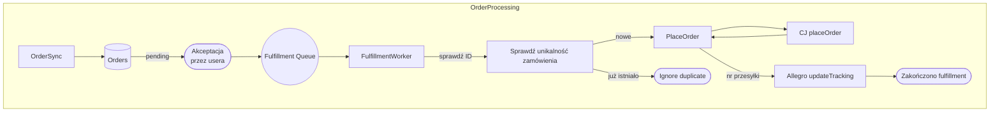
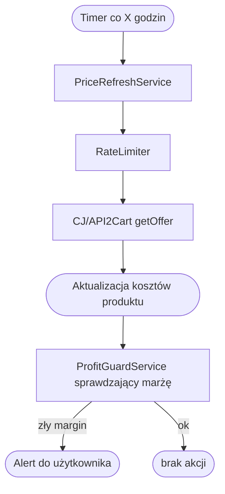

# Podsumowanie (executive summary)

Obecna aplikacja **Jurasic Dropshipping** ma dobrze rozdzielone moduły (UI, Domain, Data, Services) i działa jako monolityczny SaaS, ale brakuje w niej kluczowych elementów potrzebnych do skalowania i stabilności. W raporcie wskazano: 1) **priorytety natychmiastowe**, 2) **usprawnienia średnioterminowe** i 3) **długoterminową roadmapę skalowania**. 

Główne rekomendacje to: wprowadzenie **kolejki komunikatów (RabbitMQ/Celery)** dla zadań asynchronicznych, **zaimplementowanie idempotencji** i **ograniczania liczby wywołań API (token bucket)**, dodanie **wielotenancyjności z izolacją danych (RLS)** oraz **systemu rozliczeń/subskrypcji**. Konieczne jest też stworzenie brakujących usług: **CompetitorPricingService**, **ProfitGuard**, **ProductFingerprintService**, **StrategyEngine**, **Catalog Intelligence** czy **ListingPerformanceEngine** wraz z ich interfejsami, bazami danych i przepływami zdarzeń. Przedstawiono szczegółowy plan wdrożenia (zgodny ze sprintami 1–3 tygodni), diagramy przepływu (Mermaid) oraz priorytetową listę zadań. Wdrożenie rekomendowanych zmian pozwoli obsłużyć docelowy wolumen ~100k produktów i 50k zamówień miesięcznie przy wysokiej wydajności i niezawodności.  

# 1. Obecna architektura

- **Moduły aplikacji:**  
  - UI (Flutter; ekrany: Dashboard, Produkty, Zamówienia, itd.) – komunikacja z warstwą danych/serwisów poprzez provider/Riverpod.  
  - **Domain** – logika decyzyjna: `Scanner`, `ListingDecider`, `PricingCalculator`, `SupplierSelector`, abstrakcje **SourcePlatform/TargetPlatform**.  
  - **Data** – baza danych (Drift/PostgreSQL) z tabelami: `Products`, `Listings`, `Orders`, `DecisionLog`, `UserRules`, `Suppliers`, `SupplierOffers`, `Returns`, itd., oraz warstwa repozytoriów (CRUD).  
  - **Services** – integracje: `OrderSyncService`, `FulfillmentService`, `ListingSyncService`, `PriceRefreshService`, `AutomationScheduler` (harmonogram zadań). Używane API: Allegro OAuth, CJ, API2Cart itp.  

- **Przepływ danych (uproszczony):**  
  1. **Skanowanie:** `Scanner` (zaplanowany) pobiera oferty z hurtowni (CJ, API2Cart), `SupplierSelector` wybiera dostawcę, `ListingDecider` sprawdza marżę i tworzy wpisy `Listings` (status `draft` lub `pendingApproval`).  
  2. **Wystawianie ofert:** Po akceptacji (UI) `FulfillmentService` wywołuje `TargetPlatform.createListing` (np. Allegro) dla danego listing.  
  3. **Obsługa zamówień:** `OrderSyncService` pobiera zamówienia z marketplace, zapisuje w DB (możliwe `pendingApproval`). Po akceptacji, `FulfillmentService` wysyła zamówienie do hurtowni (`SourcePlatform.placeOrder`) i aktualizuje status (numer śledzenia) na rynku.  

- **Aktualne braki i wąskie gardła:**  
  - **Brak kolejki asynchronicznych zadań:** wszystkie operacje (skanowanie, wystawianie, fulfillment) są wykonywane synchronnie lub poprzez pojedyncze wywołania usług.  
  - **Brak idempotencji:** nie ma warstwy zapobiegającej duplikacji zamówień/listingów przy błędach/ponownych próbach.  
  - **Brak globalnego ogranicznika (rate limiting):** ryzyko przekroczenia limitów API Allegro, Temu, CJ itp., co może skutkować błędami 429.  
  - **Brak wsparcia multi-tenant:** brak pola `tenant_id` w tabelach, brak RLS – obecnie system zakłada jednego „sprzedawcę”. Dla SaaS potrzebna jest izolacja danych (np. poprzez RLS lub oddzielne schematy).  
  - **Brak systemu rozliczeń:** potrzebna integracja z płatnościami (np. Stripe) i podział na plany abonamentowe.  
  - **Brak kluczowych usług wspomagających:** np. usługa „strażnika zysku” (profit guard), monitoringu cen konkurencji, automatycznej analizy produktów. Bez tego rośnie ryzyko strat (brak alertów o ujemnych marżach) oraz brak przewagi konkurencyjnej.  

# 2. Wymagania multi-tenant i billing

- **Model izolacji danych:** Najczęściej rekomendowany w SaaS to **pool model** (pojedyncza baza z wieloma tenantami), używając **Row-Level Security (RLS)** do separacji danych【4†L10-L18】【12†L323-L332】. Przykładowo:  
  ```sql
  ALTER TABLE products ENABLE ROW LEVEL SECURITY;
  CREATE POLICY tenant_policy ON products 
    USING (tenant_id = current_setting('app.current_tenant_id')::int);
  ```  
  Dzięki RLS jedna instancja bazy obsługuje wielu klientów (optymalizacja kosztu), ale wymaga starannego logowania `app.current_tenant_id`. Alternatywy: **bridge model** (oddzielny schemat na każdego klienta w jednej instancji) lub **silo model** (oddzielna baza na klienta) – jednak te są bardziej kosztowne i skomplikowane【3†L10-L18】【4†L10-L18】. 

- **Modyfikacje DB:** Należy dodać kolumnę `tenant_id` (lub `account_id`) do kluczowych tabel: `Products`, `Listings`, `Orders`, `UserRules`, `Suppliers`, itp. Wprowadzić polityki RLS lub filtry w repozytoriach. Ewentualnie utworzyć osobne schematy per tenant i logikę wyboru schematu. **Zależność:** migracja schematu i aktualizacja warstwy danych.

- **Billing/subskrypcje:** Trzeba zaprojektować system rozliczeń: 
  - Plans (np. Basic, Pro) z limitami (ilość produktów, marketplace, zadań, etc.). 
  - Integracja z systemem płatności (Stripe, Paddle, etc.). 
  - Powiązanie `tenant_id` z kontem płatniczym, zbieranie danych o zużyciu (np. liczba aktywnych listings, zamówienia) dla ewentualnej rozliczania „pay-as-you-go”. 
  - Mechanizm porównujący użycie z planem (np. po przekroczeniu limitu – utrata możliwości wystawiania kolejnych ofert). 
  - Kalendarz subskrypcji (przypomnienia, odnowienia).

- **Monitorowanie wykorzystania:** Dodać metryki per-tenant (np. `active_listings{tenant}`, `orders_processed{tenant}`, `margin_alerts{tenant}` itp.) w narzędziu typu Prometheus, aby łatwiej wdrażać plany zgodnie z użyciem klienta.

- **Wnioski:** Przy rosnącej liczbie klientów i wolumenów konieczne jest od początku zaprojektowanie wielotenantowego modelu danych i systemu płatności. RLS z `tenant_id` to najlepszy kompromis między kosztem a izolacją【4†L10-L18】【12†L323-L332】. Na późniejszym etapie można rozważyć migrację najwięcej korzystających klientów do osobnych instancji (silo), jeśli pojawią się wymagania compliance. 

# 3. Natychmiastowe priorytety (Sprint 1–2)

## 3.1. Wprowadzenie kolejki zadań (Event Queue)

- **Dlaczego:** Zamiast wykonywać wszystko synchronicznie, należy asynchronicznie obsługiwać skanowanie hurtowni, wystawianie ofert i realizację zamówień. Queue pozwala rozdzielić producentów od konsumentów zadań (np. jeden worker zbiera zamówienia, inny wykonuje fulfillment) oraz wprowadzić retry i kolejkowanie.  
- **Technologia:** RabbitMQ + Celery (Python) – sprawdzony stack dla zadań roboczych, z wbudowanym retry, dead-letter i monitoringiem kolejki【16†L259-L268】【18†L725-L734】. Alternatywnie Redis Streams (lekka), Kafka (lepiej do analityki). **Rekomendacja:** RabbitMQ, bo idealnie nadaje się do kolejkowania zadań i workflow (patrz ScaleGrid)【18†L668-L676】.  
- **Zadania implementacyjne (średnie):**  
  - Skonfigurować brokera RabbitMQ (docker/helm/managed) i Celery w backendzie.  
  - Przełamać moduły do publikowania/odbierania: np. `Scanner` publikuje `product_scan_job`, `FulfillmentService` subskrybuje `fulfillment_job`.  
  - Zapewnić potwierdzenia ACK/NACK i retry na błędy.  
  - **Kryterium akceptacji:** Kolejka działa, demonstracyjnie wykonuje asynchronicznie wpisanie przykładowego zadania (np. prostego echa), testy pokazują retry i dead-letter.  

## 3.2. Idempotencja zadań

- **Dlaczego:** Przy ponownych wywołaniach (np. błąd sieci, timeout, dwukrotne naciśnięcie przycisku „Wykonaj”) łatwo utworzyć duplikaty. Trzeba zapobiec np. wysłaniu tego samego zamówienia do hurtowni dwa razy.  
- **Rozwiązanie:**  
  - Na poziomie **bazy danych** – unikalne ograniczenia („unique index”) dla kluczy idempotency, np. `orders(targetOrderId, targetPlatformId)` nie może się powtarzać.  
  - W **serwisach** – przed wykonaniem operacji sprawdzać, czy nie była już zarejestrowana (np. `FulfillmentService` sprawdza `Orders` po `targetOrderId`).  
  - Można też użyć **Distributed Lock** (np. Redis lock) przy realizacji zamówienia, aby uniemożliwić równoległe przetwarzanie tego samego `order_id`.  
  - W przypadku Celery: użyć `task_id` i zapisać go w bazie jako już wykonany, by przy retry Celery go odrzucała (celery idempotence token).  
  - **Kryterium akceptacji:** Próba ponownego przetworzenia identycznego zamówienia kończy się brakiem duplikatu (drugi proces wykrywa, że już wykonano wcześniej i nie wysyła ponownie). Testy ukazują „once-only” behavior.

## 3.3. Ograniczanie (Rate limiting) wywołań API

- **Dlaczego:** Allegro, Temu i inne API mają limity (liczba wywołań na sekundę, godzinę). Bez zabezpieczenia przekroczenie limitu skutkuje błędami (np. 429 Too Many Requests).  
- **Rozwiązanie:** Zaimplementować **Token Bucket** lub **Leaky Bucket** (algorytm wiadra z tokenami) dla zewnętrznych integracji【19†L146-L154】. Przykładowo: każdy target platform ma określony refil rate (np. 50 req/s). Wywołania przed wysłaniem sprawdzają dostępność tokenu (np. Redis jako wspólne źródło licznika).  
- Można użyć gotowej biblioteki (np. [limits](https://pypi.org/project/limits/) z backendem Redis) lub napisać prosty ogranicznik w Pythonie.  
- **Zadania implementacyjne (średnie):**  
  - Dodać warstwę `RateLimiter` przed każdą integracją zewnętrzną (np. w `AllegroTargetPlatform.createListing()`, `CJSourcePlatform.getOffers()` itp.).  
  - Konfigurowalne limity na platformę.  
  - **Kryterium akceptacji:** Simulacja wielu równoczesnych zapytań pokazuje, że odpowiednia liczba zostaje odrzucona/opóźniona zamiast przekraczać ustalony limit.  

## 3.4. Wielotenancyjność i RLS

- **Dlaczego:** Już wkrótce będzie wielu „sprzedawców”, każdy z własnymi produktami i ofertami. Musimy odizolować dane.  
- **Rozwiązanie:** Dodać kolumnę `tenant_id INT` (lub `account_id`) we wszystkich kluczowych tabelach (`Products`, `Listings`, `Orders`, itd.). W warstwie bazy zastosować RLS, np.:  
  ```sql
  ALTER TABLE products ENABLE ROW LEVEL SECURITY;
  CREATE POLICY tenant_policy ON products 
    FOR ALL
    USING (tenant_id = current_setting('app.current_tenant_id')::int);
  ```  
  Podobnie dla pozostałych tabel. Aplikacja przed każdym zapytaniem ustawia `app.current_tenant_id` (np. z tokena JWT lub kontekstu sesji). Dzięki temu nawet niechcący napisane `SELECT *` nie wyciągnie danych z innych tenantów【12†L323-L332】.  
- **Migracja danych:** Na początek można założyć `tenant_id=1` dla istniejącego użytkownika. Potem plan migracji: dla każdego nowego klienta przypisać inną wartość.  
- **Kryterium akceptacji:** Przy wczytywaniu danych warstwy UI, użytkownik „A” (tenant 1) nie widzi niczego z tenant 2 (przy stworzonych ręcznie danych testowych). Testy DB potwierdzają, że bez nadania `app.current_tenant_id` zapytania zwracają puste wyniki (bez odpowiedniego kontekstu RLS).

## 3.5. ProfitGuard – strażnik zysku (basic)

- **Dlaczego:** Bez automatycznej kontroli marż pojawiają się oferty ze stratą (przykład: zmiana ceny hurtownika obniżyła koszt, listing stał się ujemny). Trzeba przynajmniej ostrzegać i/lub blokować takie sytuacje.  
- **Rozwiązanie:** Tuż po obliczeniu marży w `ListingDecider` lub w osobnym zadaniu, sprawdzać minimalną marżę (np. 5%). Jeśli marża < 0 (lub poniżej zdefiniowanej w `UserRules.minProfitPercent`), to:  
  - oznaczyć listing jako **pendingApproval** lub **rejected** zamiast bezpośrednio wystawiać,  
  - oraz zapisać przyczynę w `DecisionLog` (np. „ujemna marża - oferta anulowana”).  
  - W UI dodać alert lub oddzielną listę listingów do ręcznej korekty.  
- **Kryterium akceptacji:** Dla każdego programu automatycznego załadowania ofert lista zyskownych `/niezyskownych` jest zgodna z regułami: np. oferta z kosztem wyższym niż cena sprzedaży nie zostanie wystawiona, tylko oznaczona do korekty. Testy sprawdzają scenariusz ceny hurtownik=100, marża 0%, efekt – brak wystawienia oferty i wpis w logu.

## 3.6. Monitoring i logowanie

- **Dlaczego:** Wraz ze wzrostem skomplikowania potrzebny jest monitoring działania kolejki, serwisów i bazy. 
- **Zadania:**  
  - Wybrać stack monitoringowy: **Prometheus+Grafana** do metryk oraz ELK/Graylog lub Prometheus Loki do logów.  
  - Eksportować metryki: liczba zadań w kolejkach, czas przetwarzania, liczba błędów, użycie CPU/RAM. Np. RabbitMQ ma gotowe eksportery. Dla aplikacji – liczniki `orders_processed`, `scan_jobs_success`, `queue_length`, `api_errors` etc.  
  - Alerty: np. wzrost błędów, opóźnienie kolejek > 1h, niski profit_ratio (np. >10% listingów poniżej progu).  
- **Kryterium akceptacji:** Udokumentowana konfiguracja metryk i alertów oraz przykładowe dashboardy. Symulacja błędnego stanu (np. wstrzyknięcie wielu błędów 429) wywołuje alarm. 

# 4. Średnioterminowe usprawnienia (Sprint 3–5)

## 4.1. Usługa monitoringu cen konkurencji (CompetitorPricingService)

- **Cel:** Dynamicznie pobierać ceny konkurentów i zasilać `ListingDecider`. Umożliwi strategię „always below lowest” lub „premium when better reviews” w pełni.  
- **Projekt:**  
  - **Interfejs**: klasa/serwis `CompetitorPricingService`, metoda np. `get_lowest_price(product_id, platform_id)`.  
  - **Źródła danych:** API Allegro (np. wyszukiwanie po EAN lub frazie, pobranie najtańszej oferty). Dla Amazon/Temu – odpowiednie integracje. Możliwe użycie scrapingowych API lub gotowych narzędzi (Dealavo, Priceva).  
  - **Schemat DB:** tabela np. `competitor_prices(product_id, target_platform_id, price, fetch_time)`.  
  - **Harmonogram:** wykonywać w tle po zakończeniu `Scanner` lub osobnym cronem co kilka godzin.  
  - **Integracja z ListingDecider:** gdy tworzymy listing, używać `CompetitorPricingService.get_lowest_price(...)` jako dodatkowego parametru i w `PricingCalculator` wybierać cenę zgodnie z regułą (np. ustawić cenę o 1% poniżej najniższej).  
- **Kryteria:** Test integracyjny, który pobiera konkurencyjną ofertę dla znanego produktu (można zamockować Allegro) i pokazuje, że nowa cena jest poprawnie obliczana. Porównanie manualne potwierdza wynik.

## 4.2. Rozbudowa ProfitGuard

- **Udoskonalenie:** Automatyczne reagowanie na spadek marży w czasie rzeczywistym.  
  - **Mechanizm:** `PriceRefreshService` po każdej aktualizacji kosztu hurtownika wywołuje także `ProfitGuard`. Jeśli koszt podniósł się tak, że marża ofert spadła poniżej ustawionego progu, serwis: oznacza listing jako „do sprawdzenia” i wysyła e-mail/SMS powiadomienie do użytkownika (celem obniżenia ceny lub anulowania).  
  - **Logika:** Może automatycznie ściągnąć listing z rynku, jeśli strata > X%.  
- **Wdrożenie:** Dodać akcje w `PriceRefreshService` i `FulfillmentService`. Zbieranie alertów w DB oraz notyfikacje.  
- **Kryteria:** Na przykład podnieść koszt hurtownika o 50% w teście – system powinien zareagować (ostateczna marża <0). W rezultacie wpis w logu i flaga w DB, a użytkownik dostaje powiadomienie.

## 4.3. Rozszerzenie panelu wielotenanta

- **Zadania:** Dodać do UI możliwość rejestracji i logowania wielu „sklepów” (tenantów). Każdy account tworzy własny `tenant_id`. Panel ustawień pozwala zmienić plan abonamentowy, dane kontaktowe, formy płatności.  
- **API:** Endpoints do zakładania i zarządzania subskrypcją (np. `/api/v1/subscribe`). Integracja z Stripe.  
- **RLS:** Upewnić się, że wszystkie zapytania uwzględniają `tenant_id`. 

## 4.4. Feature flags i konfiguracja

- **Dlaczego:** Umożliwi stopniowe włączanie nowych funkcji (np. Temu jako target), wyłączanie dużych modułów (AI opisów) dla niższych planów.  
- **Implementacja:** Prosty `features` w DB lub w kodzie (`kEnableTemuTarget = true/false` już jest). Można użyć biblioteki feature flag, lub prostego pliku/DB wskazującego funkcje.  
- **Kryteria:** Dodanie flagi `NewDashboardUI`; jeśli wyłączona, stara wersja jest dostępna, jeśli włączona – pojawia się nowy ekran. Testy pokrywają oba scenariusze.

## 4.5. Logowanie i obserwowalność

- Rozbudować logi o traceId (możliwie zgodnie z OpenTelemetry). Na przykład przed każdym wywołaniem API Allegro generować nowy span. Można dodać prostą integrację z OTEL lub innym narzędziem APM.  
- **Kryteria:** W logach widać spójne `trace_id` powiązane między `Scanner`, `ListingSync`, `Fulfillment`. Można prześledzić przepływ zamówienia w ELK/Grafana.

# 5. Długoterminowa roadmapa (skalowanie 100k/50k)

## 5.1. Architektura i infrastruktura

- **Mikroserwisy (opcjonalnie):** Jeśli wolumen drastycznie wzrośnie, rozdzielenie na niezależne serwisy ułatwia skalowanie: oddzielny serwis `ScanService`, `FulfillmentService`, `CatalogService`. Można konteneryzować (Docker/Kubernetes). Jednak do ~100k produktów wystarczy skalowanie monolitu + wielu workerów Celery. 
- **Baza danych:**  
  - **Replikacja:** Używać read-replica dla zapytań analitycznych (dashboard, raporty), aby nie obciążać mastera.  
  - **Partyconing:** Dzielić duże tabele (Orders, Listings) na partycje czasowe lub według tenantów. Na przykład **orders** partycjonować po dacie zamówienia (range per miesiąc)【12†L283-L292】. Lub użyć **shardingu/Citus** dla rozproszenia (np. shard per tenant lub per grupa klientów).  
  - **Indeksowanie:** Zapewnić indeksy wielokolumnowe (np. `(tenant_id, targetPlatformId, listing_status)`), aby filtrowanie po tenant_id było szybkie.  
  - **Wydzielone schematy:** Jeśli pool model przestaje wystarczać (np. klienci domagają się isolacji), rozważyć **bridge** – każdy klient w osobnym schemacie (prostsze backupy).  

- **NoSQL/Caching:** Warto dodać Redis (cache i countery), np. do przechowywania *statusów kolejki*, do ograniczania (Rate Limiter) oraz jako session-store. Może też służyć do popularnych zapytań („cache listingów topowych produktów”).  
- **Kolekcje danych (Big Data):** Przy 50k zam./m i rozbudowanej analityce, dane można wątkować do hurtowni (np. Redshift, Snowflake) dla raportów. Jednak 100k produktów to ciągle nie „big data” poziomu Google – wystarczy Postgres i ew. MQ stream.  
- **Infrastruktura:** Hostowanie w chmurze (AWS/GCP/Azure) z autoskaluącą się grupą instancji/aplikacji. Użycie managed serwisów np. AWS RDS Postgres, AWS Elasticache, MSK/Kafka (jeśli wybrano), AWS ECS/EKS dla kontenerów.  

- **Poziom 2:** Dodać **OpenTelemetry/Jaeger** do pełnego śledzenia asynchronicznych przepływów (zwłaszcza przepływów cross-serwis). 

## 5.2. Skalowanie bazy danych i performance

- **Partycjonowanie:** Jak wspomniano, tabele `orders` i `listings` mogą mieć **range partitioning** po dacie (każda partia ~ miesiąc/kwartał)【12†L283-L292】. Usprawni to czyszczenie starych danych i poprawi zapytania zakresowe.  
- **Citus lub sharding:** Jeśli wymagana wysoka dostępność zapisu, Citus może rozszerzyć Postgresa na klaster. Shardować po `tenant_id` (np. 1000 klientów na węzeł) – AWS RDS Proxy może pomóc routingiem do konkretnych instancji.  
- **Indeksowanie:** Używać partial/indexów gin/trigram do przyspieszenia wyszukiwania tekstu (np. tytułów produktów) w `Scanner`.  
- **Transakcje i MVCC:** Przy high-write (masowe wystawianie/listingi) monitorować deadlocki. Być może użyć `COPY` do masowych insertów.  

- **Read replicas:** Minimum 2-3 read replicas do obsługi zapytań UI i raportów. Zautomatyzowany failover.  

## 5.3. Skalowanie usług

- **Kolejki:** Przejść z pojedynczej instancji RabbitMQ do klastra (ha) lub rozważyć Kafka dla event-stream (np. log wszystkich „eventów” w systemie, przetwarzanie w real-time).  
- **Load balancer:** Dla API Flutera oraz serwisów backendowych (nie monolit = gorący punkt).  
- **Microservices break-down:** Jeśli monolit staje się za ciężki, wydzielić:  
  - *Catalog Service* (zarządzanie produktami/hurtowniami),  
  - *Pricing Service* (PricingCalculator, ProfitGuard, strategy engine),  
  - *Fulfillment Service* (zamówienia, integracje z dostawcami),  
  - *Marketplace Sync Service* (obsługa targetów: Allegro, eBay, Temu).  
  Każdy ze swoją bazą (lub wspólna DB z RLS) i kolejkami.  
- **Funkcje serverless:** Mniejsze skanowania (np. godzinne) można odpalić jako funkcje AWS Lambda, a RabbitMQ zastąpić SQS w prostszych przypadkach.  

## 5.4. Operacje i monitoring

- **Logi:** Centralny system logów (ELK, Grafana Loki). Rejestrować każdy ważny event (nowe zamówienie, błąd wystawienia, alert profit).  
- **Metryki:**  
  - Systemowe: CPU/RAM instancji, długość kolejek (RabbitMQ), czas odpowiedzi, użycie DB.  
  - Aplikacyjne: `orders_processed_total`, `orders_failed_total`, `listings_failed_total`, `average_margin`, `watermark_delay` (ile czasu zajmuje przetworzenie/zadania).  
  - Użytkownika: `% konwersji w czasie`, `LTV`, ale to już BI.  
- **Alerty:** Np. 90% wzrost czasu kolejek vs norma, dostępność Celery <99%, error-rate 5xx >1% itp.  

- **Testy:**  
  - **Load Testing:** narzędzia jak Locust lub JMeter: symulacja 1000 listingów/minutę, 100 zamówień/s, sprawdzenie systemu pod obciążeniem.  
  - **Chaos/Stress:** np. celowe wyłączenie instancji DB, przerwanie RabbitMQ – system powinien prawidłowo się zachować (zatrzymać przetwarzanie i wznowić po restarcie).  
  - **Monitoring środowiska:** zaplanować odpowiedni backup co godzinę, testować przywracanie bazy raz na kwartał.  

# 6. Propozycje projektowe brakujących komponentów

Poniżej szczegółowe propozycje kluczowych modułów, ich interfejsów, schematów DB i przepływów.

## 6.1. Kolejka zadań (Event/Job Queue)

- **Koncepcja:**  
  - **Producent (Publisher):** każde zadanie długotrwałe (skanowanie hurtowni, wystawianie listingów, fulfillment) publikuje komunikat do RabbitMQ z danymi zadania.  
  - **Konsument (Worker):** jeden lub więcej workerów subskrybuje kolejki (np. `scan_queue`, `fulfillment_queue`). Po odbiorze zaczynają przetwarzanie, a po zakończeniu `ACK`. W razie błędu wysyłają `NACK` (lub retry, ewentualnie wysłanie do dead-letter).  

- **Definicja interfejsu (Python, pseudokod):**

  ```python
  # Publisher (np. w Scanner):
  rabbitmq.publish(
      queue="product_scan_queue",
      payload={"supplier_id": 123, "keywords": ["led", "lamp"]}
  )

  # Consumer (w workerze):
  def handle_scan_job(payload):
      supplier_id = payload["supplier_id"]
      products = SourcePlatform.search(supplier_id, payload["keywords"])
      for p in products:
          ListingDecider.decide_and_store(p)
      rabbitmq.ack()
  rabbitmq.consume(queue="product_scan_queue", callback=handle_scan_job)
  ```

- **Rozkład kolejek:** Sugerowany podział (kolejka = kolejka RabbitMQ):  
  - `scan_queue` – zlecenia skanowania hurtowni, wyzwalane co X minut.  
  - `listing_queue` – utworzone oferty do wystawienia (domyślnie low-latency, gdy user manualnie akceptuje).  
  - `order_queue` – nowe zamówienia z marketplace czekające na fulfilment.  
  - `price_refresh_queue` – cykliczne odświeżanie cen z hurtowni.  
  - `competitor_price_queue` – pobieranie cen konkurencji.  

- **Flowchart – proces skanowania i wystawiania ofert:**

```mermaid
flowchart TB
  subgraph Składnia produktów
    Trigger(Planowany trigger<br/>(Automatyczny Scan)) -->|publikuje job| ScanQueue((Scan Queue))
    ScanQueue --> ScannerSvc[Scanner Service Worker]
    ScannerSvc --> SupplierAPI[CJ/API2Cart]
    SupplierAPI --> ScannerSvc
    ScannerSvc --> SupplierSelectorSvc[SupplierSelector]
    SupplierSelectorSvc --> ListingDeciderSvc[ListingDecider]
    ListingDeciderSvc --> ListingDB[(Listings DB)]
    ListingDB --> PendingUI[Do akceptacji (UI)]
    ListingDB --> CreatedListing[Wystawiono ofertę<br/>(jeśli auto)]
  end

  subgraph Flow zamówień
    OrderSync(Planner/Subskryber) --> OrderQueue((Order Queue))
    OrderQueue --> OrderDB[(Orders DB)]
    OrderDB --> PendingOrderUI[Do akceptacji zamówienia (UI)]
    PendingOrderUI --> FulfillQueue((Fulfillment Queue))
    FulfillQueue --> FulfillmentSvc[Fulfillment Service Worker]
    FulfillmentSvc --> SourceAPI[CJ/API2Cart<br/>(placeOrder)]
    SourceAPI --> FulfillmentSvc
    FulfillmentSvc --> TargetAPI[Allegro/Temu<br/>(update tracking)]
    TargetAPI --> FulfillmentSvc
  end
```

- **Kryterium projektu:** Wszystkie zadań generowane przez te przepływy trafiają do kolejki i są przetwarzane asynchronicznie, a logika `Scanner`, `Fulfillment` itp. działa jako niezależne workery.  

## 6.2. RateLimiter (Token Bucket)

- **Interfejs:** Klasa `RateLimiter` z metodą `acquire(tokenKey, capacity, refillRate)`. Jeśli są wolne tokeny, pozwala kontynuować; jeśli nie – czeka lub podnosi wyjątek. Przykładowo użycie z Redisem:  

  ```python
  class RateLimiter:
      def __init__(self, redis_conn): self.redis = redis_conn
      def acquire(self, key: str, capacity: int, refill_rate: float) -> bool:
          # token_bucket na kluczu Redis + time-based refill
          ...
  ```

- **Zastosowanie:** Przed każdym wywołaniem do Allegro/Temu/CJ o wrap i `if not rateLimiter.acquire("allegro_create", 10, 10/sec): sleep/delay`.
- **Przykład:**  

  ```python
  if rate_limiter.acquire("allegro_create_listing", capacity=50, refill_rate=1.0):
      AllegroAPI.create_listing(...)
  else:
      # odłożyć zadanie, powtórzyć po chwili
  ```
- **Kryterium:** W testach symulować 100 zapytań do Allegro na sekundę i potwierdzić, że tylko 50 trafia natychmiast, pozostałe są rozłożone w czasie zgodnie z limitem (lub odrzucone z kodem 429).

## 6.3. Idempotency/Locki

- **Idempotency na API:** Dla endpointów HTTP dodawać nagłówek `Idempotency-Key`; przy jego obecności sprawdzać, czy już taki klucz został użyty przez daną sesję. Można zapisywać parę `(user_id, idempotency_key)` w Redisie lub DB z datą utworzenia.  
- **Mechanizm DB:** Dla np. tabeli `Orders` dodać kolumnę `source_order_id` (unikat) i ustawić `UNIQUE (tenant_id, targetPlatformId, source_order_id)`. W `FulfillmentService`, przed wywołaniem `placeOrder` sprawdzić czy identyczny `source_order_id` (dostarczony np. z CJ) już istnieje – jeśli tak, przerwać.  
- **Distributed Lock:** Przykład za pomocą Redis:  

  ```python
  from redis import Redis
  from redis.lock import Lock

  redis_conn = Redis(...)
  lock = Lock(redis_conn, name=f"order_lock:{order_id}", timeout=30)
  with lock:
      # przetworzyć zamówienie
      ...
  ```

  Dzięki temu dwa równoległe procesy `FulfillmentJob` nie zamówią 2x ten sam produkt u hurtownika.
- **Kryterium:** Testy obciążeniowe, gdzie dwa wątki jednocześnie próbują zrealizować zamówienie, skończą się jednym zamówieniem fizycznym. Unikalność DB i lock sprawiają, że drugi wątek zignoruje duplikat.

## 6.4. CompetitorPricingService

- **Cel:** Dostarczyć informację o cenach konkurencji na platformie docelowej w celu lepszego ustalania cen.  
- **Interfejs:**  

  ```python
  class CompetitorPricingService:
      def get_lowest_price(self, product: Product, target_platform_id: str) -> Decimal:
          """Zwraca najniższą cenę danego produktu na wskazanym marketplace"""
  ```

- **Baza danych:**  

  ```sql
  CREATE TABLE competitor_prices (
      id SERIAL PRIMARY KEY,
      product_id INT NOT NULL REFERENCES products(id),
      target_platform_id VARCHAR NOT NULL,
      price NUMERIC(12,2) NOT NULL,
      fetched_at TIMESTAMPTZ DEFAULT CURRENT_TIMESTAMP
  );
  ```

- **Workflow:** Po każdym utworzeniu listingów lub w osobnym cron: dla każdego `product_id`, `target_platform_id` pobrać **najniższą** dostępną cenę (np. przez odpowiednie API Allegro/Amazon). Zapis danych w `competitor_prices`.  
- **Integracja:** `ListingDecider` korzysta z tej usługi: jeśli reguła cenowa to *competitive*, pobiera cenę konkurencji i ustawia swoją cenę poniżej.  
- **Kryterium:** Testy integracyjne z mockiem Allegro API, gdzie `CompetitorPricingService.get_lowest_price(...)` zwraca na podstawie fikcyjnych danych (np. 120.00 PLN), a `ListingDecider` ustawia ofertę np. 119.00 (poniżej najniższej) lub +premium w zależności od strategii.  

## 6.5. ProfitGuardService

- **Cel:** Automatycznie wykrywać, gdy marża spada poniżej progu, i reagować (np. delist/zalogować).  
- **Interfejs:**  

  ```python
  class ProfitGuardService:
      def evaluate_listing(self, listing: Listing) -> ProfitGuardResult:
          """Sprawdza profit listing. Jeśli poniżej progu, zwraca alert (z margin, threshold)."""
  ```
- **DB:** Można użyć istniejącej `DecisionLog` do zapisywania naruszeń lub wprowadzić dodatkową tabelę `profit_alerts(listing_id, margin, threshold, checked_at)`.  
- **Algorytm:** Na aktualizacji cen (albo co minutę) przejść przez aktywne listings: obliczyć marżę (`sellingPrice - sourceCost - fees`). Jeśli \< `minProfitPercent`, to: oznaczyć (status=`warning` lub `paused`) i zapisać log.  
- **Reakcja:** Możliwość automatycznego wyciągnięcia oferty z ruchu (np. ustawić status `archived`). Powiadomienia do UI/email.  
- **Kryterium:** Scenariusz testowy, gdzie cena źródła zmienia się, aby pokazać że listing trafia do `profit_alerts` i staje się nieaktywny.  

## 6.6. ProductFingerprintService

- **Cel:** Wyeliminować duplikaty produktów i oferty tego samego towaru z różnych hurtowni.  
- **Interfejs:**  

  ```python
  class ProductFingerprintService:
      def find_duplicates(self, product: Product) -> List[Product]:
          """Zwraca listę podobnych produktów już istniejących (np. wg nazwy, EAN, zdjęcia)."""
  ```
- **Metody:**  
  - *Tekst:* przycinanie i porównywanie tytułów (np. fuzzy match / trigram DB).  
  - *EAN/UPC/ISBN:* jeśli dane dostępne, łatwe dopasowanie.  
  - *Obrazy:* hashing (perceptual hash, np. pHash) i porównanie (Python `imagehash` + baza hashowana).  
- **DB:** Dodać pole `fingerprint BYTEA` lub `text` do `Products` i `SupplierOffers`. Zapis hashów obrazów.  
- **Workflow:** Po pobraniu produktu ze źródła, przed utworzeniem nowego `Product` sprawdzić `fingerprint` w DB. Jeśli znaleziony podobny → ujednolicić rekord (np. zaktualizować tylko cenę) zamiast duplikować.  
- **Kryterium:** W teście dwa produkty z identycznym EAN lub bardzo podobnymi obrazami powinny zostać zidentyfikowane jako te same i zapisane jako jeden `Product` (drugi zostaje zmergowany).

## 6.7. StrategyEngine

- **Cel:** Wybór strategii cenowej na podstawie KPI i danych.  
- **Interfejs:**  

  ```python
  class StrategyEngine:
      def select_pricing_strategy(self, product: Product, stats: Statistics) -> PricingStrategy:
          """Wybiera strategię (fixed_markup, match_lowest, etc.) bazując na danych (sprzedaży, marżach)."""
  ```
- **Wejście:** statystyki konwersji, marginesy historyczne (`DecisionLog`) i bieżące KPI.  
- **Wyjście:** jedna z strategii definiowanych w `UserRules.pricingStrategy`.  
- **Implementacja:** Może zostać jako część `ListingDecider` lub oddzielna usługa. Bazuje np. na priorytecie „maksymalizuj zysk” vs. „maksymalizuj obrót”. Algorytm: np. jeśli produkt ma niską sprzedaż, wybierz cenę niższą niż konkurencja (volume), a jeśli dobre opinie, możesz trzymać wyższą marżę (premium).  
- **Kryterium:** Testy jednostkowe pokazują, że dla różnych danych (dużo vs mało sprzedaży) wynikiem jest różna strategia (np. w statystykach zakładamy, że `premium_when_better_reviews` zwraca taką strategię, gdy rating>0.9).

## 6.8. Catalog Intelligence (Rekomendacje produktów)

- **Cel:** Pomoc klientowi w wyborze ofert – np. analiza zbiorcza sprzedaży i zysku w kategoriach.  
- **Początek:** Zbieranie danych do hurtowni danych (np. eksport do CSV lub do OLAP).  
- **Funkcje:**  
  - **Rekomendacje top N produktów** – np. analiza wzrostów sprzedaży w ostatnim miesiącu; 
  - **Filtrowanie produktów do usunięcia** – np. niskomarżowe i niskosprzedające; 
  - **Predykcja trendów** – np. ML siędzenie, ale to pilne niskie.  
- **Interfejs (przykład):**  

  ```python
  class CatalogIntelligenceService:
      def get_product_recommendations(self, user_id, top_n) -> List[ProductSummary]:
          """Zwraca top n najbardziej obiecujących produktów z hurtowni/dostawców."""
  ```
- **DB:** Tabela `product_insights(product_id, score, last_month_sales, last_month_profit, kpi)`.  
- **Kryterium:** Rekomendacje dostępne (np. dla listy nowości) – testowane na zasymulowanych danych (np. najlepsze produkty to te z najwyższą sprzedażą + zyskami).

## 6.9. ListingPerformance Engine

- **Cel:** Mierzyć jak dobrze sprzedają się wystawione listingi (CTR, konwersje, ROI) i reagować.  
- **Metryki:** 
  - Odsłony (jeśli API Allegro je udostępnia), 
  - liczba sprzedanych sztuk, 
  - zwroty, 
  - marża zysku.  
- **Interfejs:**  

  ```python
  class ListingPerformanceService:
      def update_stats(self, listing_id, views, sold, returns): ...
      def analyze(self, listing_id) -> PerformanceMetrics:
          """Zwraca konwersję (sold/views), ROI, itd."""
  ```
- **DB:** Dodatkowe kolumny w `Listings` lub osobna tabela `listing_stats(listing_id, views, sold, date)`.  
- **Reakcja:** Automatyczne dostosowywanie cen na podstawie skuteczności (np. jeśli konwersja < 0.5%, obniż cenę lub wycofaj ofertę).  
- **Kryterium:** Po serii testowych zamówień widoczne jest, że `ListingPerformanceService` odzwierciedla spodziewaną konwersję i gdy spada poniżej progu, wykonuje akcję (np. zmiana ceny).

# 7. Przepływy systemowe (Mermaid)

**Flow scan → listing → order → fulfillment:**

```mermaid
flowchart TB
    subgraph Asynchroniczny Scan
      Cron[(Planowalny trigger)] -->|publikuje job| QueueScan((Kolejka Scan))
      QueueScan --> ScannerSvc[Scanner Worker]
      ScannerSvc --> SupplierAPI[CJ/API2Cart search]
      SupplierAPI --> ScannerSvc
      ScannerSvc --> SupplierSelector[SupplierSelector]
      SupplierSelector --> ListingDecider[ListingDecider]
      ListingDecider --> ListingsDB[(Tabela Listings)]
      ListingsDB --> UIApproval{Akceptacja<br/>(UI)}
      UIApproval -->|tak| QueueListing((Kolejka wystawienia))
      UIApproval -->|nie| Skip[Brak wystawienia]
    end

    subgraph Asynchroniczny Fulfillment
      QueueListing --> ListingWorker[ListingSync Worker]
      ListingWorker --> TargetAPI[Allegro/Temu createListing]
      TargetAPI --> ListingWorker
      ListingWorker --> ListingsDB

      OrderSync[(Scheduler zamówień)] -->|publikuje| QueueOrder((Kolejka Zamówień))
      QueueOrder --> OrderDB[(Tabela Orders)]
      OrderDB --> OrderApproval{Akceptacja zamówienia<br/>(UI)}
      OrderApproval -->|tak| QueueFulfill((Kolejka Fulfillment))
      QueueFulfill --> FulfillmentWorker[Fulfillment Worker]
      FulfillmentWorker --> SourceAPI[CJ/API2Cart placeOrder]
      SourceAPI --> FulfillmentWorker
      FulfillmentWorker --> TargetAPI2[Allegro/Temu updateTracking]
      TargetAPI2 --> FulfillmentWorker
      FulfillmentWorker --> OrdersDB
    end
```

**Flow order → fulfillment (z idempotencją):**



**Flow odświeżania cen z rate limitingiem:**



# 8. Sprint backlog (priorytety)

Poniższa tabela to przykładowe podziały na sprinty (1–3 tyg.). **Story points:** S=1-3d, M=7d, L>=2 tyg. **Zależności:** co musi być wcześniej.

| Sprint | Ticket                            | Cel (Value)                                                                                                     | Kryteria akceptacji                                                         | Punkty | Zależności                |
|--------|-----------------------------------|---------------------------------------------------------------------------------------------------------------|-----------------------------------------------------------------------------|--------|---------------------------|
| 1      | Wprowadzenie RabbitMQ & Celery    | Dodanie RabbitMQ jako brokera i Celery jako workerów                                                             | Kolejka działa – prosty task (print) wykonany asynchronicznie              | M      | Brak, bazuje na środowisku|
| 1      | IdempotencyKey w zamówieniach    | Zapobiec duplikatom zamówień w `FulfillmentService`                                                            | Próba złożyć to samo zamówienie dwukrotnie – tylko raz trafi do hurtowni    | S      | Implementacja kolejek     |
| 1      | Rate limiter dla Allegro API     | Ograniczyć max 50 req/s do Allegro                                                                             | Przy próbie 100 req/s – tylko ~50 trafia (reszta zwraca błąd/ciężar)        | M      | Brak                       |
| 1      | Dodanie tenant_id i RLS (DB)     | Wstępna implementacja wielotenant, dodanie `tenant_id` do tabel                                                 | Zapytanie z nieodpowiednim tenantem zwraca 0 wierszy (RLS włączone)         | M      | Migracja DB                |
| 1      | Podstawowy ProfitGuard           | Blokada wystawienia ofert z negatywną marżą (0%)                                                               | Listing z marżą 0% nie zostaje wystawiony, trafia do logów jako błąd         | S      | Zmiany w ListingDecider   |
| 2      | Konsumery Celery dla zadań Fulfillment, Scan | Przeniesienie `Scanner` i `FulfillmentService` do zadań Celery                                                   | `Scanner` publikuje job, a worker go wykonuje (log entries w bazie)         | M      | RabbitMQ, Task queue     |
| 2      | Testy jednostkowe i integracyjne| Pokrycie kluczowych modułów testami (Scanner, Decider, Service)                                                | Code coverage ~80%, test stwierdza poprawność przy różnych wejściach        | S      | Brak                       |
| 2      | Monitorowanie RabbitMQ i Celery  | Ustawienie Prometheus exporter dla RabbitMQ i Celery (opcjonalnie)                                              | Metryki kolejki i zadań widoczne w Prometheusu/Grafanie                    | S      | RabbitMQ konfiguracja     |
| 2      | UI – oznaczenia pendingApproval  | W UI zakładka “Do akceptacji” listuje Listings/Orders z pendingApproval status                                  | Widok poprawnie filtruje oferty oczekujące akceptacji                       | M      | Zmiany w bazie statusów   |
| 3      | CompetitorPricingService – prototyp | Podstawowa integracja do pobierania cen konkurencji                                                             | Mockowane dane – metoda zwraca np. hard-coded wartość, ListingDecider korzysta | M      | Brak (po Celery)         |
| 3      | Feature Flags (konfiguracja)     | Mechanizm włączania/wyłączania funkcji (np. Temu, AI opisy)                                                     | Flagi w konfigu (DB lub env) – test pokazuje różne zachowanie z on/off      | S      | Brak                       |
| 3      | Multi-account support            | Możliwość podłączenia wielu kont Allegro/Temu dla jednego tenant                                               | Konfiguracja DB pozwala na wiele wpisów w `MarketplaceAccounts` dla jednego użytkownika | M      | RLS + zmiany w UI    |
| 3      | Logging śledzenie (Traces)      | Dodanie correlation_id/trace_id do logów (opentelemetry)                                                        | Na koniec procesu wszystkie logi zawierają ten sam trace_id                 | M      | Brak                       |
| 4      | Partycjonowanie tabel (Orders)   | Partycjonowanie `orders` po dacie (np. tabela miesięczna)                                                       | Nowe zamówienia trafiają do odpowiednich partycji (testy zakresów dat)     | L      | Migracje bazy              |
| 4      | Rozliczenia – integracja z Stripe| System subskrypcji i płatności miesięcznych/plany                                                             | Możliwość przypisania planu do tenant, wpis w DB o subskrypcji             | L      | RLS + tenant_id            |
| 4      | Kafka – event streaming (opcjonalnie) | Przekierowanie logów zdarzeń do Kafki (np. fulfillment events)                                                 | Wysyłka przykładowego eventu do tematu Kafka, czytelnik odbiera dane       | L      | Wybrana technologia kolejek |
| 4      | Obsługa 100k produktów         | Testy obciążeniowe bazy (~100k produktów) – optymalizacje indeksów                                             | Zapytanie typu `/products` zwraca w granicach SLA (poniżej 300ms)          | M      | Database tuning           |
| 5      | Automatyczne skalowanie (K8s)    | Przeniesienie aplikacji do Kubernetes (EKS/GKE/AKS), autoscaling backendu                                        | Wzrost ruchu (symulowany) powoduje skalowanie podów, brak errorów           | L      | Cloud infra               |
| 5      | Analiza danych i BI             | Wyeksportowanie danych zamówień/sprzedaży do hurtowni (np. Snowflake/Redshift)                                 | Próba raportu agregującego sprzedaż dzienną z nowej hurtowni                | L      | ETL pipeline (Airflow?)   |
| 5      | Logowanie i backupy baz       | Pełny plan backup/restore bazy z testem odtworzenia                                                             | Udokumentowane i wykonane przywrócenie DB z backupu                        | M      | DB Management             |

**Wskazówki:** Sprinty należy dostosować do dostępnych zasobów. Powyższy backlog to przykład podziału. Tickets priorytetyzować wg **ważności biznesowej** (stabilność i skalowalność) i **technicznego długu**.  

# 9. Monitoring i testy

- **Monitoring:**  
  - *Grafana/Prometheus*: metryki jak długość kolejek (`rabbitmq_queue_messages`), fail rate (np. liczniki 5xx lub odrzuconych próśb), średnie czasy zapytań do Allegro. Panle z throughputu (zlecenia/min), stanu DB (liczba wierszy w orders).  
  - *Alerty*: np. jeśli `OrdersPending > 100` (duży back-log), błąd połączenia z Hurtownią w >95% prób, wyczerpanie miejsca na dysku DB powyżej 80%.  
  - *Logs*: wszystkie wyjątki logować, korzystać z ELK lub AWS CloudWatch Logs. Konfigurować `log_level`, np. WARN i ERROR w normalnych warunkach, debug jedynie przy problemach.  
- **Testy:**  
  - *Jednostkowe:* Cena kalkulatora, decydowanie oferty, parsowanie odpowiedzi API, itp.  
  - *Integracyjne:* Symulacja pełnych przepływów (np. Scanner → DB → Fulfillment), z mockami zewnętrznych API, sprawdzenie stanów końcowych.  
  - *Load testy:* Narzędzia: [Locust](https://locust.io/), JMeter, [Gatling](https://gatling.io/). Testy np. 1000 jednoczesnych użytkowników tworzących zamówienia, duże importy.  
  - *Chaos testing:* Narzędzia jak [Chaos Monkey](https://netflix.github.io/chaosmonkey/), rzucanie błędów sieci, zabijanie instancji – system powinien sobie poradzić (np. automatycznie wznowić zadania lub je przywrócić).  

# 10. Rekomendowane technologie i źródła

- **RabbitMQ + Celery:** sprawdzony w Pythonie stack do task queue (patrz [ScaleGrid](https://scalegrid.io/blog/rabbitmq-vs-kafka/) o zastosowaniach RabbitMQ【18†L668-L676】). Umożliwia kolejki typu **fanout**, routing, dead-letter. Alternatywa: Kafka (jeśli potrzebny log zdarzeń).  
- **PostgreSQL:** z **partyconingiem** (range/historial partitioning) przy dużych tabelach【12†L283-L292】 i **RLS** (izolacja tenantów)【12†L323-L332】. Ewentualnie **Citus** dla większej skali.  
- **Redis:** jako cache oraz do implementacji **RateLimiter** (token bucket w Redis jest wygodny) oraz Redis Lock dla idempotencji.  
- **Stripe/Braintree/Paddle:** do billing/subskrypcji (dokumentacja online; zależnie od regionu).  
- **OpenTelemetry + Jaeger/Zipkin:** do śledzenia rozproszonego (przykład OneUptime【23†L155-L164】 pokazuje korzyści z traceId).  
- **Monitoring:** Prometheus + Grafana, ELK (Elasticsearch). Źródła dobrych praktyk to dokumentacja Prometheus, książki o obserwowalności.  

**Podsumowanie:** Implementując powyższe usprawnienia i technologie, uzyskamy skalowalny i niezawodny ekosystem drop‑shippingowy. Priorytetyzacja zadań w formie sprintów pozwoli na stopniowe rozszerzanie systemu bez negatywnego wpływu na bieżący biznes. Dzięki solidnej architekturze przyszłe zwiększanie skali (100k produktów, 50k zamówień) będzie możliwe bez rewolucji w kodzie. 

**Źródła:** Dobre praktyki wielotenancyjności (AWS RLS)【4†L10-L18】【12†L323-L332】, różnice RabbitMQ/Kafka【18†L668-L676】【18†L725-L734】, algorytm token bucket【19†L146-L154】. Podane przykłady czerpią też z branżowych wzorców (np. Shopify, Allegro).