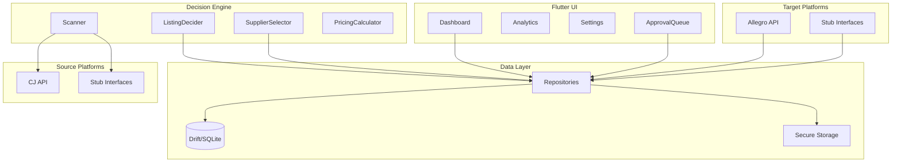

# Architecture

## Overview

Jurassic Dropshipping is a single-user Flutter app that automates product sourcing, listing, and order fulfillment for the Polish market. All data is obtained via **official APIs only** (no scraping).

## High-level flow

## Layers

- **UI** (`lib/features/`): Screens (dashboard, products, orders, approval queue, decision log, settings). State via Riverpod; navigation via go_router.
- **Domain** (`lib/domain/`): Platform interfaces (`SourcePlatform`, `TargetPlatform`), decision engine (scanner, listing decider, supplier selector, pricing). No I/O except through interfaces.
- **Data** (`lib/data/`): Models (freezed), Drift schema, repositories. All persistence and mapping live here.
- **Services** (`lib/services/`): API clients (CJ, Allegro), secure storage, order sync, fulfillment. Implement domain interfaces and call repositories where needed.

## Data flow

1. **Scan**: User runs scan (or scheduled). Scanner loads rules, calls each source’s `searchProducts`, applies SupplierSelector and ListingDecider, persists products/listings and decision logs. If manual approval is ON, listings stay in `pendingApproval`.
2. **Approval**: User approves/rejects listings in Approval queue. On approve, target’s `createListing` is called and listing status set to active.
3. **Orders**: OrderSyncService polls targets’ `getOrders(since)`, inserts new orders. If manual approval is ON, orders stay in `pendingApproval`.
4. **Fulfillment**: User approves order (or it’s auto-approved). FulfillmentService resolves listing → product → source, calls source’s `placeOrder`, then updates tracking on target when available.

## Where decision logic lives

- **ListingDecider** (`lib/domain/decision_engine/listing_decider.dart`): Min profit %, max source price, blacklists; produces accept/reject and criteria snapshot for DecisionLog.
- **SupplierSelector** (`lib/domain/decision_engine/supplier_selector.dart`): Preferred countries, total cost, delivery time; used when multiple sources offer the same product.
- **PricingCalculator** (`lib/domain/decision_engine/pricing_calculator.dart`): Selling price = source cost + markup + marketplace fee estimate.

## Approval toggles

- `UserRules.manualApprovalListings`: when true, scanner creates listings in `pendingApproval`; they are only published after user approval in the Approval screen.
- `UserRules.manualApprovalOrders`: when true, new orders from targets are stored as `pendingApproval`; FulfillmentService runs only after user approval.

See [DECISION_LOGIC.md](DECISION_LOGIC.md) for rule details and [ADDING_A_MARKETPLACE.md](ADDING_A_MARKETPLACE.md) for extending sources/targets.
