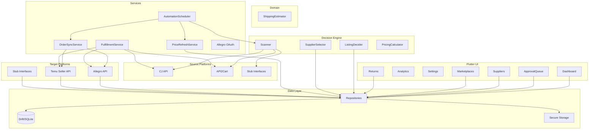

# Architecture

## Overview

Jurassic Dropshipping is a single-user Flutter app that automates product sourcing, listing, and order fulfillment for the Polish market. All data is obtained via **official APIs only** (no scraping).

## High-level flow

## Layers

- **UI** (`lib/features/`): Screens (dashboard, products, orders, suppliers, marketplaces, returns, approval queue, decision log, settings). State via Riverpod; navigation via go_router. Responsive layout: NavigationRail on wide screens (>= 600px), drawer on small screens.
- **Domain** (`lib/domain/`): Platform interfaces (`SourcePlatform`, `TargetPlatform`), decision engine (scanner, listing decider, supplier selector, pricing), shipping estimator. No I/O except through interfaces.
- **Services** (`lib/services/`): API clients (CJ, API2Cart, Allegro, Temu), secure storage, order sync, fulfillment, price refresh, automation scheduler, Allegro OAuth. Implement domain interfaces and call repositories where needed.
- **Data** (`lib/data/`): Models (freezed), Drift schema, repositories. All persistence and mapping live here.

## Repositories

| Repository | Table | Purpose |
|-----------|-------|---------|
| `ProductRepository` | `products` | Source products from scan results |
| `ListingRepository` | `listings` | Target marketplace listings |
| `OrderRepository` | `orders` | Customer orders from targets |
| `DecisionLogRepository` | `decisionLogs` | Audit trail for listing/order decisions |
| `RulesRepository` | `userRulesTable` | User-configurable rules and preferences |
| `SupplierRepository` | `suppliers` | Supplier profiles with return policies |
| `SupplierOfferRepository` | `supplierOffers` | Per-product supplier offers with pricing/shipping |
| `ReturnRepository` | `returns` | Customer return requests and resolution |
| `MarketplaceAccountRepository` | `marketplaceAccounts` | Connected marketplace account credentials |

## Services

| Service | File | Purpose |
|---------|------|---------|
| `OrderSyncService` | `order_sync_service.dart` | Polls targets for new orders, inserts with optional pending approval |
| `FulfillmentService` | `fulfillment_service.dart` | Resolves listing → product → source, places source order, updates tracking |
| `PriceRefreshService` | `price_refresh_service.dart` | Refreshes stale supplier offer prices from source platforms |
| `AutomationScheduler` | `automation_scheduler.dart` | Timer-based orchestrator for scanner, order sync, and price refresh |
| `AllegroOAuthService` | `allegro_oauth_service.dart` | Allegro authorization code flow via local HTTP redirect |

## Data flow

1. **Scan**: User runs scan (or scheduled via AutomationScheduler). Scanner loads rules, calls each source's `searchProducts`, applies SupplierSelector and ListingDecider, persists products/listings and decision logs. If manual approval is ON, listings stay in `pendingApproval`.
2. **Approval**: User approves/rejects listings in Approval queue. On approve, target's `createListing` is called and listing status set to active.
3. **Orders**: OrderSyncService polls targets' `getOrders(since)`, inserts new orders. If manual approval is ON, orders stay in `pendingApproval`.
4. **Fulfillment**: User approves order (or it's auto-approved). FulfillmentService resolves listing → product → source, calls source's `placeOrder`, then updates tracking on target when available.
5. **Price refresh**: PriceRefreshService finds offers with stale prices (older than threshold, default 6h), re-fetches from source platforms, and updates the supplier offer records.
6. **Returns**: Customer returns are tracked with status progression (requested → approved → shipped → received → refunded/rejected) and financial impact (refund amount, return shipping cost, restocking fee).

## Where decision logic lives

- **ListingDecider** (`lib/domain/decision_engine/listing_decider.dart`): Min profit %, max source price, blacklists, absolute profit floor (5 PLN), 10x sanity check; produces accept/reject and criteria snapshot for DecisionLog.
- **SupplierSelector** (`lib/domain/decision_engine/supplier_selector.dart`): Preferred countries, total cost, delivery time; used when multiple sources offer the same product.
- **PricingCalculator** (`lib/domain/decision_engine/pricing_calculator.dart`): Selling price = source cost + markup + marketplace fee estimate. Also: `calculateSafeSellingPrice` (return risk buffer), `estimateReturnCost`.
- **ShippingEstimator** (`lib/domain/shipping_estimator.dart`): Estimates delivery windows (min/max days + date range) from carrier shipping days and seller handling time.

## Approval toggles

- `UserRules.manualApprovalListings`: when true, scanner creates listings in `pendingApproval`; they are only published after user approval in the Approval screen.
- `UserRules.manualApprovalOrders`: when true, new orders from targets are stored as `pendingApproval`; FulfillmentService runs only after user approval.

See [DECISION_LOGIC.md](DECISION_LOGIC.md) for rule details, [ADDING_A_MARKETPLACE.md](ADDING_A_MARKETPLACE.md) for extending sources/targets, and [MONEY_SAFETY.md](MONEY_SAFETY.md) for financial safety guardrails.
